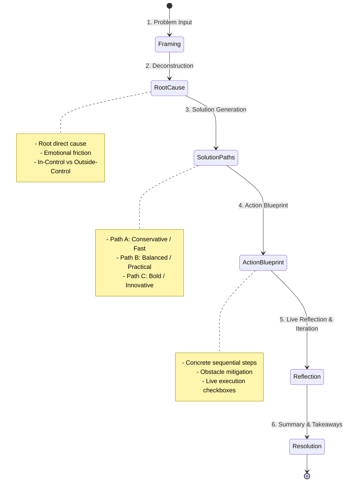

# 🧠 MindBridge AI: Personal Reflection & Real-Time Problem-Solving Platform

MindBridge AI is an intelligent full-stack AI companion platform built on **React 19**, **Express.js**, **Google Gemini API (`@google/genai`)**, **Firebase Authentication**, and **Cloud Firestore**. 

It transforms abstract thoughts, stressful dilemmas, and ambitious goals into structured, actionable intelligence through multi-turn conversational journaling, a 6-stage root-cause problem solver, decision comparison matrices, SMART goal breakdown, and privacy-first memory isolation.

---

## 📐 System Architecture & Data Flow

```mermaid
flowchart TD
    subgraph Client["Frontend Client (React 19 + Vite + Tailwind CSS)"]
        UI[Interactive UI / SPA]
        Voice[Web Speech Voice Input]
        AuthContext[Auth Context & Guest Fallback]
        FSClient[Firestore Client SDK]
    end

    subgraph Server["Backend Engine (Express.js + Vite Middleware)"]
        AuthMiddleware[Firebase Auth Token Verifier]
        GeminiLadder[Gemini Model Fallback Ladder\n(gemini-2.5-flash ➔ gemini-flash-latest ➔ gemini-3.7-flash)]
        Endpoints[AI Routing & Prompt Engineering Engine]
    end

    subgraph GoogleCloud["Google Cloud & Firebase Infrastructure"]
        FirebaseAuth[Firebase Authentication\n(Google SSO + Anonymous)]
        FirestoreDB[(Cloud Firestore\nPer-User Isolated Collections)]
        GeminiAPI[Google Gemini 2.5 / 3.7 API]
    end

    UI -->|Voice Audio| Voice
    Voice -->|Transcribed Text| UI
    UI -->|Auth State & Tokens| AuthContext
    AuthContext -->|Verify Session| FirebaseAuth
    UI -->|Read / Write Documents| FSClient
    FSClient -->|Secured with request.auth.uid == userId| FirestoreDB

    UI -->|API Requests with Bearer Token| AuthMiddleware
    AuthMiddleware -->|Validated Identity| Endpoints
    Endpoints -->|Prompt + Context| GeminiLadder
    GeminiLadder -->|Multimodal / Structured JSON| GeminiAPI
    GeminiAPI -->|Inference Result| GeminiLadder
    GeminiLadder -->|Safe Parsed JSON / Text| Endpoints
    Endpoints -->|AI Intelligence Response| UI
```

---

## 🔄 6-Stage Problem Resolution Lifecycle



---

## 🌟 Core Features

1. **AI Reflection & Journaling**: Multi-turn conversational journaling with automated extraction of core topics, obstacles, decisions, and immediate next steps.
2. **Real-Time Problem Solver**: Deconstructs complex dilemmas into root causes, separates controllable vs. uncontrollable factors, and provides 3 strategic pathways.
3. **Decision Matrix Assistant**: Compare 2–4 competing choices side-by-side evaluating financial cost, time commitment, emotional friction, and 5-year outlook.
4. **SMART Goal Management**: Automatically breaks ambitious goals into measurable milestones, complete with progress tracking and estimated completion times.
5. **Creative Brainstorming**: Expands nascent concepts using first-principles thinking, 10x differentiators, and practical launch roadmaps.
6. **Daily & Weekly Intelligence Reviews**: Synthesizes past journals and completed problem sessions into pattern recognitions and proactive weekly retrospectives.
7. **Privacy-First AI Memory**: Isolates all user memory items strictly under individual Firebase UIDs (`/users/{uid}/...`) with full controls to inspect, edit, or purge data anytime.
8. **Multi-Language Support**: Full native support for **English**, **Hindi (हिन्दी)**, and **Hinglish**.
9. **Speech-to-Text Voice Dictation**: Hands-free voice reflection via the browser Web Speech API.

---

## ⚙️ Environment Variables & Necessary Inputs

Create a `.env` file in the project root with the following variables:

```env
# Required: Google Gemini API Key for AI reflection & reasoning
GEMINI_API_KEY="YOUR_GEMINI_API_KEY"

# Application Base URL
APP_URL="http://localhost:3000"

# Optional: Disable Hot Module Replacement (HMR) during agent edits
DISABLE_HMR="false"
```

### Firebase Configuration (`firebase-applet-config.json`)

Ensure your `firebase-applet-config.json` is properly populated with your Firebase project credentials:

```json
{
  "projectId": "YOUR_FIREBASE_PROJECT_ID",
  "appId": "YOUR_FIREBASE_APP_ID",
  "apiKey": "YOUR_FIREBASE_API_KEY",
  "authDomain": "YOUR_FIREBASE_PROJECT_ID.firebaseapp.com",
  "databaseURL": "https://YOUR_FIREBASE_PROJECT_ID-default-rtdb.firebaseio.com",
  "firestoreDatabaseId": "default",
  "storageBucket": "YOUR_FIREBASE_PROJECT_ID.firebasestorage.app",
  "messagingSenderId": "YOUR_MESSAGING_SENDER_ID",
  "measurementId": "YOUR_MEASUREMENT_ID"
}
```

---

## 🗄️ Firestore Database Schema

MindBridge enforces strict per-user data isolation under `/users/{userId}/`:

| Path | Description |
| :--- | :--- |
| `/users/{uid}/profile/settings` | User profile, language preference, proactive toggles |
| `/users/{uid}/journalEntries/{id}` | Reflection journal logs, messages, and extracted intelligence |
| `/users/{uid}/problemSessions/{id}` | 6-stage problem solver sessions and execution blueprints |
| `/users/{uid}/goals/{id}` | SMART goals and milestone checklist progress |
| `/users/{uid}/decisions/{id}` | Multi-option factor matrices, weights, and outcome analysis |
| `/users/{uid}/brainstorms/{id}` | Brainstorming sessions, creative angles, and action cards |
| `/users/{uid}/memories/{id}` | Long-term memory records for context injection |
| `/users/{uid}/dailyInsights/{id}` | Daily synthesized summaries and key learnings |
| `/users/{uid}/weeklyInsights/{id}` | Weekly retrospectives and habit metrics |

### Security Rules (`firestore.rules`)
```javascript
rules_version = '2';
service cloud.firestore {
  match /databases/{database}/documents {
    match /{document=**} {
      allow read, write: if false;
    }
    match /users/{userId} {
      allow read, write: if request.auth != null && request.auth.uid == userId;
      match /{allSubcollections=**} {
        allow read, write: if request.auth != null && request.auth.uid == userId;
      }
    }
  }
}
```

---

## 🚀 Getting Started

### 1. Install Dependencies
```bash
npm install
```

### 2. Run the Development Server
```bash
npm run dev
```
Open [http://localhost:3000](http://localhost:3000) in your browser.

### 3. Type Checking & Production Build
```bash
# Type check TypeScript files
npm run lint

# Production bundle
npm run build

# Start production server
npm run start
```

---

## 🛡️ Security & Threat Model

- **Zero Client-Side API Key Exposure**: All Gemini AI calls are made strictly from the Node/Express backend; keys are never bundled into client JavaScript.
- **Resilient Fallback Ladder**: Automatically retries across `gemini-2.5-flash`, `gemini-flash-latest`, and `gemini-3.7-flash` with exponential backoff on transient quota limits.
- **Strict User Isolation**: Firestore security rules ensure users can only ever access their own UID namespace.
- **Anonymous & Local Guest Support**: If Firebase Anonymous Auth is not enabled in Firebase Console, the system automatically runs with a seamless local guest session so features remain accessible without blocking the user.
